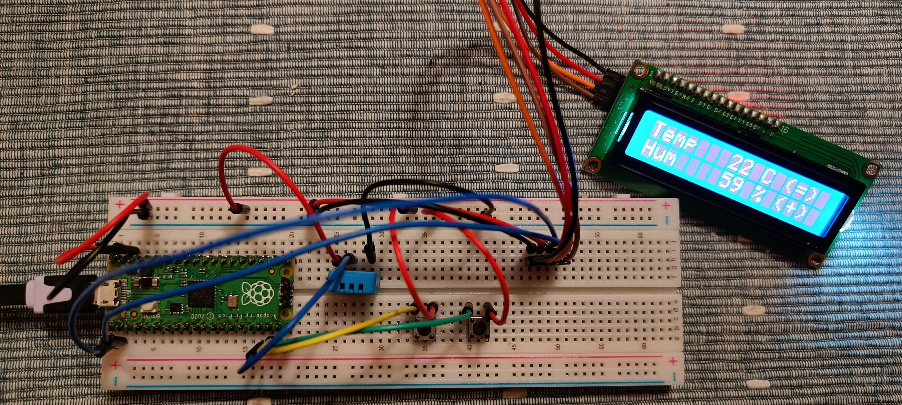

# Pico weather station
This is a simple weather station based on Raspberry Pi Pico. It displays current temperature (°C) and humidity (%). When you press the button it switches mode to show min-max values measured since the device was started.

## Component list and connections to Pico

### DHT 11 - Temperature and humidity sensor
Connections:
- VCC to Pico's VBUS
- GND to Pico's GND
- DAT to Pico's GP13

### LCD display 2x16 with I2C interface
Connections:
- VCC to Pico's VBUS
- GND to Pico's GND
- SDA to Pico's I2C0 SDA (GP0)
- SCL to Pico's I2C0 SCL (GP1)

### Tact switch
Connections:
- Use 2 switches to connect Pico's VBUS to GP14 (mode switch) and GP15 (backlight switch)

## My setup photo:

